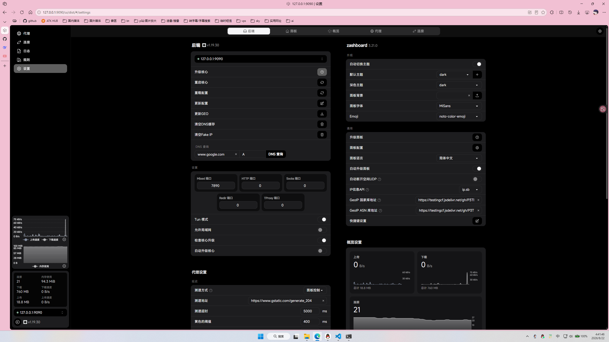
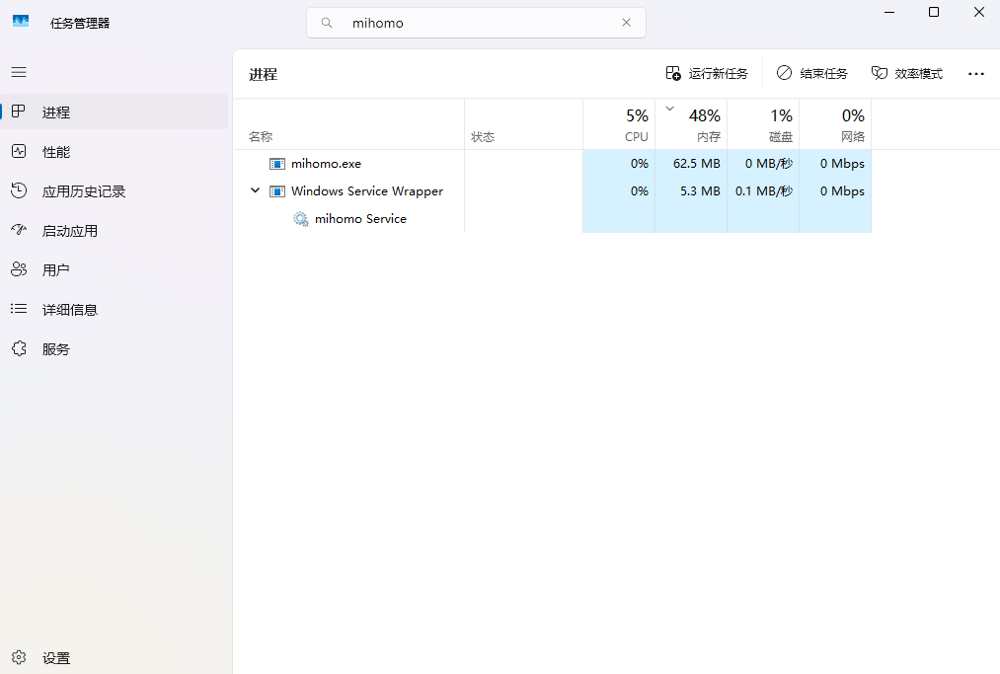

# Mihomo Windows 服务

使用 [WinSW](https://github.com/winsw/winsw) 将 [Mihomo](https://github.com/MetaCubeX/mihomo) 配置为 Windows 系统服务，实现开机自动启动。
web ui可视化操作


极小的内存占用


## 目录结构
```text
mihomo/
├─ mihomo.exe
├─ mihomo-service.exe
├─ mihomo-service.xml
├─ config.yaml
├─ ruleset/
├─ proxies/
├─ logs/
└─ 数据库和 geodata 文件（如 *.mmdb、geosite.dat）
```

## 配置文件

1. 编辑 `config.yaml`，将配置中的订阅 URL 替换为自己的订阅链接。
2. 编辑 `mihomo-service.xml`，将 `<executable>`、`<arguments>` 和 `<workingdirectory>` 中的示例路径替换为目标目录的实际路径。
3. 确认 `mihomo-service.xml` 与 `mihomo-service.exe` 文件名中的服务前缀一致。

> 注意：如果修改了 `mihomo-service.xml`，应先停止并卸载当前 WinSW 服务，再重新安装并启动服务，修改才会生效。
> 注意：如果修改了 `config.yaml`，请重启 Mihomo 服务后再继续使用，以确保新的配置生效。

## 安装并启动服务

请以管理员身份打开 PowerShell，并按以下顺序执行, 确保cd进入程序目录

### 1. 进入程序目录

```powershell
# 以你实际目录为主, 本文以 `C:\Users\hui43\Downloads\mihomo` 为例
cd C:\Users\hui43\Downloads\mihomo
```

### 2. 安装服务

```powershell
.\mihomo-service.exe install
```

### 3. 启动服务

```powershell
.\mihomo-service.exe start
```

### 4. 验证服务状态

```powershell
Get-Service mihomo
# 状态显示为 `Running` 表示服务已启动；`Automatic` 启动模式会让服务在 Windows 开机时自动启动。
```


> 重要：如果后续修改了 `config.yaml`，请执行以下命令重启服务：
>
> ```powershell
>.\mihomo-service.exe restart
> ```
>
> 如果修改了 `mihomo-service.xml`，请按照顺序执行：
>
> ```powershell
> .\mihomo-service.exe stop
> .\mihomo-service.exe uninstall
> .\mihomo-service.exe install
> .\mihomo-service.exe start
> ```
>
> 以上操作完成后，再继续使用或验证服务状态。

## 运行 Web UI

本目录的 `ui/` 文件夹包含 zashboard Web UI。

在浏览器输入
```text
http://127.0.0.1:9090/ui
```

### 打开 Mihomo web面板

打开 Web UI 后，添加或编辑后端配置：

```text
地址：http://127.0.0.1:9090
密钥：config.yaml 中 secret 的值,默认为空
```

## 组件更新说明

> 说明：本项目已包含运行所需的主要文件，通常无需重复下载。只有在所需的项目更新、文件缺失或重新部署时，才需要执行下面的更新步骤。

### 1. 下载 Mihomo

如果所需的 Mihomo 版本更新，或者项目中的 `mihomo.exe` 缺失，可以从 [Mihomo Releases](https://github.com/MetaCubeX/mihomo/releases) 下载适合系统架构的 Windows 版本，解压后将 `mihomo.exe` 放入目标目录。

也可以在 PowerShell 中下载 v1.19.30 示例压缩包：

```powershell
# 外网
curl.exe -L -o mihomo.zip https://github.com/MetaCubeX/mihomo/releases/download/v1.19.30/mihomo-windows-amd64-v3-v1.19.30.zip

# 国内网络
curl.exe -L -o mihomo.zip https://ghfast.top/https://github.com/MetaCubeX/mihomo/releases/download/v1.19.30/mihomo-windows-amd64-v3-v1.19.30.zip
```

解压 `mihomo.zip`，并将其中的 `mihomo.exe` 放入目标目录。

### 2. 下载 WinSW

如果所需的 WinSW 版本更新，或者项目中的 `mihomo-service.exe` 缺失，可以从 [WinSW Releases](https://github.com/winsw/winsw/releases) 下载 `WinSW-x64.exe`，重命名为 `mihomo-service.exe`，放入与 `mihomo.exe` 相同的目录。

PowerShell 下载示例：

```powershell
# 外网
curl.exe -L -o mihomo-service.exe https://github.com/winsw/winsw/releases/download/v2.12.0/WinSW-x64.exe

# 国内网络
curl.exe -L -o mihomo-service.exe https://ghfast.top/https://github.com/winsw/winsw/releases/download/v2.12.0/WinSW-x64.exe
```

## 服务管理

```powershell
# 查看状态
Get-Service mihomo

# 停止服务
.\mihomo-service.exe stop

# 重启服务
.\mihomo-service.exe restart

# 卸载服务（需要先停止服务）
.\mihomo-service.exe uninstall
```

> 说明：修改 `mihomo-service.xml` 后，需停止并卸载当前服务，再重新安装并启动服务；修改 `config.yaml` 后，需重启 Mihomo 服务才能使配置生效。

## 日志

WinSW 日志目录由 `mihomo-service.xml` 中的 `<logpath>` 指定，`<logmode>roll</logmode>` 表示日志按大小滚动。Mihomo 的运行日志也会根据 `config.yaml` 中的日志配置生成。

如果服务无法启动，请依次检查：

- `mihomo-service.xml` 中的路径是否真实存在。
- `mihomo.exe`、`mihomo-service.exe` 和 `mihomo-service.xml` 是否位于同一目录。
- `config.yaml` 是否存在且格式正确。
- `logs` 目录及其写入权限是否正常。

## 本项目使用到的项目

- Mihomo：用于代理与规则管理，项目地址 https://github.com/MetaCubeX/mihomo
- WinSW：用于将 Mihomo 注册为 Windows 服务，项目地址 https://github.com/winsw/winsw
- zashboard：用于本地 Web UI 控制面板，项目地址 https://github.com/Zephyruso/zashboard

